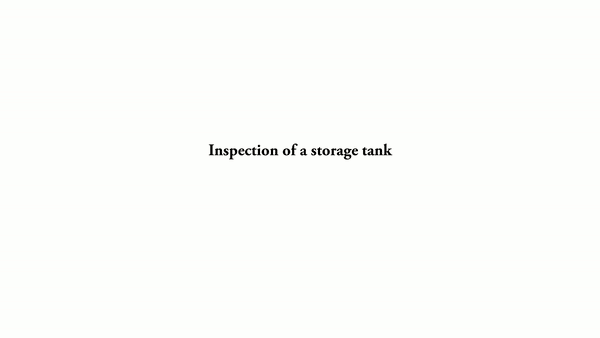

# Online Informative Path Planning for Active Information Gathering of a 3D Surface




This repository contains the code for the paper:

**<a href="https://ieeexplore.ieee.org/document/9561963">Online Informative Path Planning for Active Information Gathering of a 3D Surface</a>**
<br>
<a href="https://scholar.google.com/citations?user=8LVgpw0AAAAJ&hl=en">Hai Zhu</a>, 
Jen Jen Chung, Nicholas R.J. Lawrance, Roland Siegwart, Javier Alonso-Mora
<br>
published in **ICRA 2021**. You can find the full-text paper <a href="https://arxiv.org/pdf/2103.09556.pdf">here</a>. 

If you find this code useful in your research then please cite:
```
@inproceedings{Zhu2021ICRA,
    author = {Zhu, Hai and Chung, Jen Jen and Lawrance, Nicholas R.J. and Siegwart, Roland and Alonso-Mora, Javier},
    booktitle = {2021 IEEE International Conference on Robotics and Automation (ICRA)},
    pages = {1488--1494},
    publisher = {IEEE},
    title = {{Online Informative Path Planning for Active Information Gathering of a 3D Surface}},
    year = {2021}
}
```

## Installation instructions
The code has been tested in Ubuntu 18.04 with MATLAB R2019b. 

## Running simulations
* Open a MATLAB instance, and run ```setPath.m``` to add necessary paths. 
* Informative planning: ```mGP_cmaes_full.m```
* Simple coverage: ```mGP_coverage.m```
* Random inspection: ```mGP_random.m```
* Plot inspection results: ```plot_planning_inspection.m```
* Animate inspection process: ```plot_results_animation.m```
